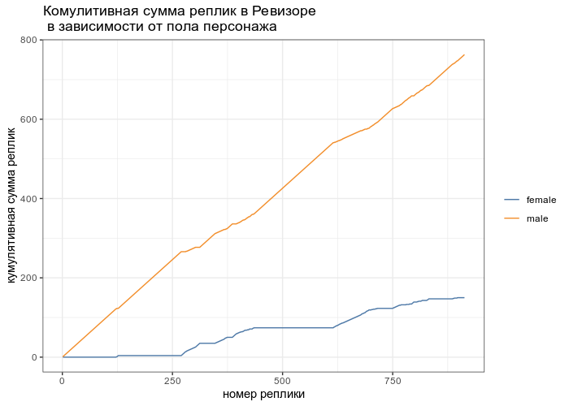

# Хакатон курса по dh 2019-2020

* разбейтесь на команды по 2-6 человек
* пройдите [по ссылке](https://classroom.github.com/g/YfD5o4pX), создайте свою команду и начните работать в созданном репозитории
* предлогаемый тайм-лайн хакатона:
    - 15:00--16:00 разбиение на команды, выбор проекта, обсуждение плана проекта, разделение обязанностей среди участников, создание репозитория проекта
    - 16:00--19:00 активная разработка проекта с перерывом на пиццу
    - 19:00--20:00 команда готовится к презентации результатов проекта
    - 20:00--20:40 все прекращают работать (к этому времени, и презентация, и все рабочие материалы группы должны быть в репозитории) и слушают презентации проектов
    - 20:40--21:00 комиссия говорит свои замечания, советы, идеи

Не стесняйтесь задавать вопросы менторам, если что-то не получается. Не стесняйтесь перемешивать языки: если что-то не получается в R, сделайте на Python, если так проще.

## Задача 1
Один из участников [I-ого онлайн-хакатона в поддержку политических заключенных](https://github.com/developers-against-repressions/devs-against-the-machine) сделал сайт <http://lastword.pythonanywhere.com/>, на котором собраны публикациии последних слов заключенных. Сделайте корпус из собранных там текстов и выделите наиболее значимые слова, общие для этих текстов, а также посмотрите, как эти слова представлены в конкретных текстах.

## Задача 2
Проанализируйте соотношение мужских и женских реплик в корпусе [rusdracor](https://github.com/dracor-org/rusdracor). Может быть полезен [пакет rdracor](https://github.com/dracor-org/rdracor).

## Задача 3
На википедии есть страницы, посвященные каждому столетию, например, [21](https://en.wikipedia.org/wiki/Timeline_of_the_21st_century). Сделайте датасет со списком событий и проанализируйте его. Насколько виден европоцентризм в отображении исторических событий? Нет ли эффекта круглых чисел (когда событий в даты заканчивающиеся на 0 и 5 больше, чем остальные)? Может быть полезен [пакет pediarr](https://github.com/chainsawriot/pediarr).
